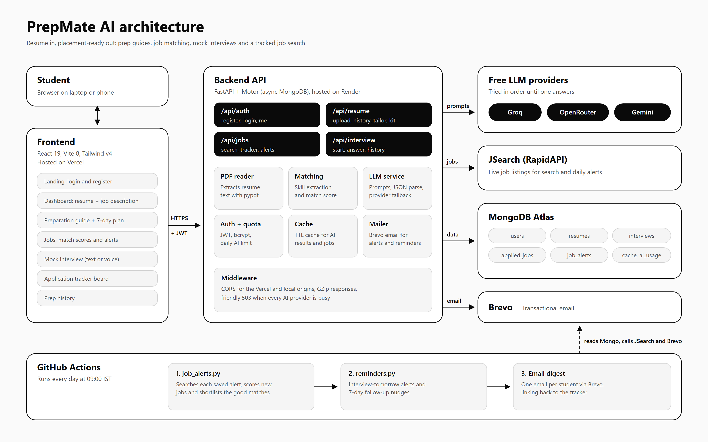

# PrepMate AI

PrepMate AI helps students get placement-ready. Upload a resume and a job description, and it builds a personalised preparation guide with a 7-day plan, finds matching jobs with a skill match score, runs scored mock interviews, writes tailored applications, and tracks every application through to the offer.

- **Live app:** https://prep-mate-ai-frontend.vercel.app
- **API:** https://prepmateai-backend-38q2.onrender.com (health check at `/api/health`)

The project is split into two repositories: a React **frontend** (Vercel) and a FastAPI **backend** (Render). This README describes both.



---

## Features

### 1. Accounts
- Register and log in with email and password. Passwords are hashed with bcrypt.
- Sessions use a signed JWT stored in the browser. Registering signs you in straight away.

### 2. Preparation guide
- Upload a PDF resume (up to 5 MB) and paste the job description you are targeting.
- The AI compares the two and writes a guide with:
  - Candidate summary
  - Skills found in the resume, grouped by category
  - Skills the role requires
  - Skill gaps, each with a reason
  - Topics to prepare
  - Technical and HR interview questions
  - A **7-day preparation plan**
  - A best learning resource for each day, plus bonus resources
- The guide page shows all of this in a structured layout:
  - Skills appear as chips, and gaps and questions as cards.
  - The 7-day plan is a timeline where each day shows its own resource link.
  - "Mark done" buttons track your progress, saved in the browser.
  - A sticky contents sidebar tracks your place, and the guide can be saved as a PDF.
- "Practise in a mock interview" opens the mock interview already filled with the same role and job description.
- Every guide is saved to **Prep history**, where you can reopen or delete it.

### 3. Job search with match scores
- Search live job listings by role and location (JSearch on RapidAPI).
- Every listing gets a **match score**: the share of the job's skills that appear on your resume. Matched and missing skills are listed with it.
- Skill extraction is rule-based: over 100 skills and their aliases, including stacks like MERN and MEAN. It is instant and costs no AI calls.

### 4. Daily job alerts with auto-shortlisting
- Save up to 3 searches as daily alerts, each with a minimum match score (default 60%).
- Every morning a scheduled job:
  - runs each alert and skips jobs you have already seen;
  - scores the new jobs;
  - adds the good matches to your tracker as **Shortlisted**;
  - emails you a digest of the top matches.

### 5. Resume tailoring (ATS)
For any job, the AI returns:
- a fit summary;
- the job's keywords missing from your resume;
- a rewritten professional summary;
- up to 5 improved resume bullets;
- practical tips.

The prompt forbids inventing experience, skills or employers.

### 6. Application kit
One click prepares everything needed to apply:
- a tailored cover letter;
- a short recruiter or LinkedIn message;
- ready answers to common application questions ("Why this company?", "Why are you a good fit?", and so on).

Each part has a copy button. Kits made for a tracked job are saved with that job.

### 7. Mock interviews
- Pick a role, optional job description, interview type (technical, HR or mixed), difficulty (easy, medium or hard) and 3 to 10 questions.
- Answer by typing or by **voice** (browser speech recognition).
- Each answer is scored out of 10, with strengths, improvements and a stronger sample answer.
- Unfinished interviews can be resumed. Past sessions are listed on the setup screen with their overall score, or progress if unfinished.

### 8. Application tracker
- A board with the stages Shortlisted, Applied, Online test, Interview, Offer and Rejected.
- Each job stores notes, an interview date, its match score, where it came from (manual or alert) and its application kit.
- Stats show total applications, response rate, interviews and offers.

### 9. Email reminders
The same daily job sends:
- a reminder the day before a scheduled interview;
- a follow-up nudge when an application has had no update for 7 days.

### 10. Built to run on free tiers
- **AI fallback chain:** requests go through a list of free models on Groq, OpenRouter and Gemini, tried in order until one answers. Providers without an API key are skipped. When every provider is busy, the API returns a friendly 503 message.
- **Caching:** AI results are cached in MongoDB for a week, keyed by a hash of the inputs. Job searches are cached too, so repeated requests are instant and free.
- **Daily AI quota** per user (default 25 calls). The quota is refunded when a call fails.
- Async MongoDB (Motor), database indexes, GZip responses, and PDF parsing off the event loop.

### 11. Interface
- Black and white design with Bricolage Grotesque and Geist fonts, and colour photography on the landing and sign-in pages.
- Smooth scrolling (Lenis), reveal animations as you scroll, animated page transitions, toasts and confirm dialogs.
- Responsive down to mobile. Animations are switched off for people who prefer reduced motion.

---

## How it works

1. **Sign in.** The frontend stores the JWT and sends it on every API request.
2. **Upload.** `POST /api/resume/upload` extracts the PDF text, checks the cache, and asks the LLM chain for a guide. It saves the resume text and detected skills on the user, and stores the guide in history.
3. **Prepare.** The guide page parses the guide into sections, the 7-day timeline and resources.
4. **Practise.** `POST /api/interview/start` generates questions. Each `POST /api/interview/{id}/answer` returns a score and feedback.
5. **Find jobs.** `GET /api/jobs/search` fetches listings and scores them against the saved resume skills. Tailoring and application kits reuse the saved resume text.
6. **Track.** Jobs are added to the tracker and moved between stages.
7. **Automate.** GitHub Actions runs `job_alerts.py`, then `reminders.py`, every day at 09:00 IST and emails results through Brevo.

---

## Tech stack

| Layer | Technology |
|---|---|
| Frontend | React 19, Vite 8, Tailwind CSS v4, React Router 7, Axios, Lenis, Lucide icons |
| Backend | FastAPI, Uvicorn, Motor (async MongoDB), Pydantic v2, pypdf, python-jose (JWT), passlib + bcrypt, httpx |
| AI | Free models via Groq, OpenRouter and Gemini (OpenAI-compatible APIs) |
| Data | MongoDB Atlas |
| Jobs | JSearch API (RapidAPI) |
| Email | Brevo |
| Hosting | Vercel (frontend), Render (backend), GitHub Actions (daily jobs) |

---

## API reference

All routes except register and login need an `Authorization: Bearer <token>` header.

| Method | Route | Purpose |
|---|---|---|
| POST | `/api/auth/register` | Create an account and return a token |
| POST | `/api/auth/login` | Log in and return a token |
| GET | `/api/auth/me` | Current user profile |
| POST | `/api/resume/upload` | Upload a PDF and job description, generate a guide |
| GET | `/api/resume/history` | List saved guides |
| DELETE | `/api/resume/history/{id}` | Delete a saved guide |
| POST | `/api/resume/tailor` | Tailor the resume for a job |
| POST | `/api/resume/application-kit` | Cover letter, recruiter message and answers |
| GET | `/api/jobs/search` | Live job search with match scores |
| GET / POST | `/api/jobs/applied` | List or add tracked jobs |
| PATCH / DELETE | `/api/jobs/applied/{id}` | Update the stage, notes or date, or remove a job |
| GET / POST | `/api/jobs/alerts` | List or create daily alerts (max 3) |
| DELETE | `/api/jobs/alerts/{id}` | Delete an alert |
| POST | `/api/interview/start` | Start a mock interview |
| POST | `/api/interview/{id}/answer` | Submit an answer and get feedback |
| GET | `/api/interview/history` | Past interview sessions |
| GET | `/api/interview/{id}` | One session with all answers |

Interactive docs are available at `/docs` on the running backend.

---

## Project structure

```
backend/
  main.py            App setup, CORS, GZip, 503 handler, routers
  config.py          Environment variables and the LLM fallback chain
  database.py        MongoDB collections, indexes, TTL cache helpers
  deps.py            Auth dependency, ObjectId helper, daily AI quota
  auth.py            Password hashing and JWT
  llm_service.py     Prompts for guide, tailoring, kit, interviews, evaluation
  matching.py        Rule-based skill extraction and match score
  jobs.py            JSearch client
  pdf_reader.py      PDF text extraction
  mailer.py          Brevo email helper
  job_alerts.py      Daily alert runner (auto-shortlisting)
  reminders.py       Daily interview and follow-up reminders
  routers/           auth, resume, jobs, interview
  .github/workflows/reminders.yml

frontend/src/
  pages/             Home, Login, Register, Dashboard, PreparationGuide, Jobs,
                     AppliedJobs, MockInterview, PrepHistory, TailorModal
  components/        Nav, AuthLayout, Modal, ApplicationKitModal, Reveal,
                     SmoothScroll, Toast
  api.js             Axios client with the JWT interceptor
  styles.css         Design tokens, components and motion
```

---

## Running locally

### Backend

```bash
cd backend
python -m venv venv
venv\Scripts\activate        # macOS/Linux: source venv/bin/activate
pip install -r requirements.txt
cp .env.example .env         # then fill in the values
uvicorn main:app --reload    # http://localhost:8000
```

Environment variables (`backend/.env`):

| Variable | Required | Notes |
|---|---|---|
| `MONGO_URL` | Yes | MongoDB Atlas connection string |
| `SECRET_KEY` | Yes | Signs JWTs. Generate with `python -c "import secrets; print(secrets.token_urlsafe(48))"` |
| `GROQ_API_KEY` | At least one AI key | Fastest free provider |
| `OPENROUTER_API_KEY` | Optional | Free fallback models |
| `GEMINI_API_KEY` | Optional | Free fallback model |
| `RAPIDAPI_KEY` | For job search | JSearch on RapidAPI |
| `LLM_CHAIN` | Optional | Override the model order, as `provider:model,provider:model` |
| `AI_DAILY_LIMIT` | Optional | AI calls per user per day, default 25 |
| `BREVO_API_KEY`, `BREVO_SENDER_EMAIL` | For email | Alerts and reminders |
| `FRONTEND_URL` | Optional | Used for links in emails |

### Frontend

```bash
cd frontend
npm install
echo VITE_API_URL=http://localhost:8000/api > .env.development.local
npm run dev                  # http://localhost:5173
```

Without `VITE_API_URL`, the frontend talks to the deployed Render API. The backend only allows `http://localhost:5173` locally, so keep that port.

---

## Deployment

- **Frontend (Vercel):** build with `npm run build`, output folder `dist`. Set `VITE_API_URL` to the Render API URL ending in `/api`.
- **Backend (Render):** start with `uvicorn main:app --host 0.0.0.0 --port $PORT` and add the environment variables above.
- **Daily jobs (GitHub Actions):** add `MONGO_URL`, `RAPIDAPI_KEY`, `BREVO_API_KEY`, `BREVO_SENDER_EMAIL` and `FRONTEND_URL` as repository secrets. The workflow runs every day at 09:00 IST and can also be started by hand.

---

## Author

Built by **Shaik Mahammed Asif**.
